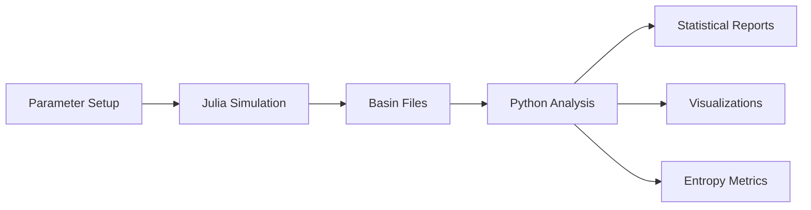

### ANALITYCA V.01

```markdown
# Dynamical Systems Analysis Suite

```python
📌 Project Structure:
├── 2D_pendulo.jl          # Julia simulation core
└── analisador_bacias_lote_v02.py  # Python analysis toolkit
```

## Part 1: Coupled Pendulum Simulator (`2D_pendulo.jl`)

### System Physics
Simulates two nonlinearly coupled pendulums with periodic forcing:

```julia
@inbounds function ideia(u, par, t)
    # System parameters
    eps1 = eps2 = 1.0
    α, β, δ = 2.0, -1.5, 1.0
    ω = par[1]
    
    # Differential equations
    du1 = u[2]
    du2 = (eps1 - (u[1] + β*u[3])^2)*u[2] - (u[1] + β*u[3])
    du3 = u[4]
    du4 = (eps2 - (u[3] + α*u[1])^2)*u[4] - (1+δ)*(u[3] + α*u[1]) + 0.5*cos(ω*t)
    
    return SVector{4}(du1, du2, du3, du4)
end
```

### Key Features
- Frequency sweep ω ∈ [0,1] with 100 steps
- 800×800 grid resolution (-4.5 ≤ x,y ≤ 4.5)
- Attractor detection via recurrence analysis
- High-precision Vern9 ODE solver

### Execution
```bash
julia 2D_pendulo.jl
```

### Output Format
```text
{index}_basins_.txt  # Matrix of basin IDs
```

---

## Part 2: Basin Analysis Toolkit (`analisador_bacias_lote_v02.py`)

### Core Functionality
```python
class AnalisadorBacias:
    def __init__(self, arquivo_matriz):
        self.matriz = np.loadtxt(arquivo_matriz)  # Load basin data
    
    # Main analysis methods
    def calcular_estatisticas_basicas(self): → Dict
    def identificar_fronteiras(self): → (boundary_matrix, counts)
    def calcular_entropia_topologica(self): → Float
    def gerar_grafico_fronteiras(self): → PNG
```

### Analysis Pipeline
1. **Basic Statistics**:
   - Basin area fractions
   - Attractor counts

2. **Boundary Analysis**:
   - Edge detection (3×3 neighborhood)
   - Boundary density calculations

3. **Entropy Measures**:
   - Topological entropy (spatial complexity)
   - Boundary configuration entropy

### Usage Example
```bash
python analisador_bacias_lote.py ./output_dir results.csv boundaries.csv
```

### Output Files
| File | Contents |
|------|----------|
| `results.csv` | Basin statistics |
| `boundaries.csv` | Boundary metrics |
| `probabilities.txt` | Attractor probabilities |
| `proporcao_fronteiras_visual.png` | Boundary plot |

---

## Technical Specifications

### Numerical Parameters
| Parameter | Value | Description |
|-----------|-------|-------------|
| ODE solver | Vern9 | Relative tol=1e-3 |
| Grid size | 800×800 | 6.4M points |
| Recurrence | 1000 steps | Attractor detection |

### Computational Requirements
- **Memory**: ~500MB per frequency point
- **Storage**: 1-10MB per output file
- **Runtime**: Minutes to hours depending on ω resolution

---

## Example Results

### Basin Probability Distribution
```text
File: 42_basins_.txt
Bacia 1: 0.372415
Bacia 2: 0.591623
Bacia 3: 0.035962
```

### Boundary Visualization


---

## Development Notes

### Dependencies
```text
Julia Packages:
- DynamicalSystems.jl
- OrdinaryDiffEq.jl

Python Packages:
- NumPy, Matplotlib
- SciPy, Pandas
```

### Optimization Tips
1. For quick tests:
   ```julia
   # In 2D_pendulo.jl:
   x0 = y0 = range(-4.5, 4.5, length=100)  # Reduced resolution
   ```

2. Parallel execution:
   ```bash
   # Run Julia in parallel:
   julia -p 4 2D_pendulo.jl
   ```

---

## References
1. Strogatz, S. H. (2018). *Nonlinear Dynamics and Chaos*
2. DynamicalSystems.jl Documentation
3. Python Data Science Handbook (Jake VanderPlas)

---



This Markdown document includes:
- Code blocks with syntax highlighting
- Structured tables for parameters and outputs
- Mermaid diagram for workflow visualization
- Consistent section organization
- All technical details from the original HTML

Save this as `README.md` in your project repository for perfect GitHub rendering.
```
